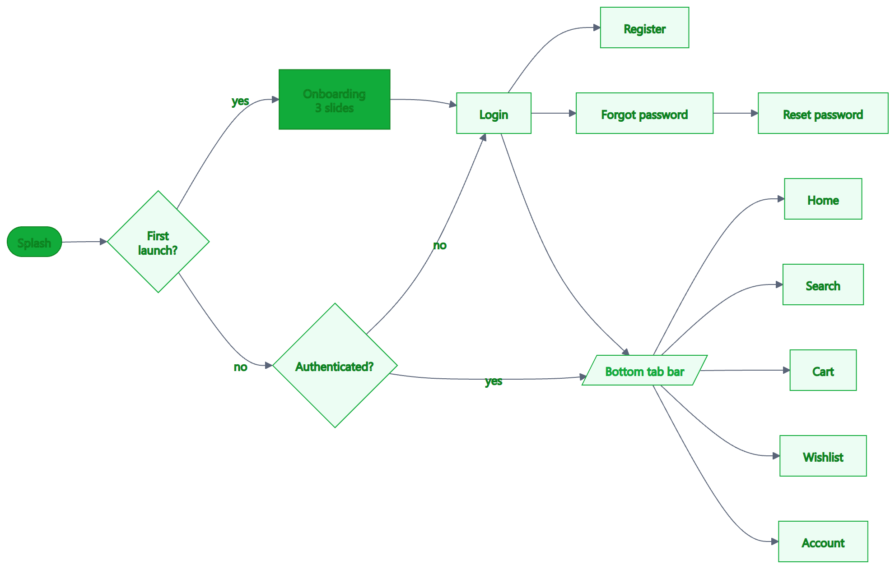
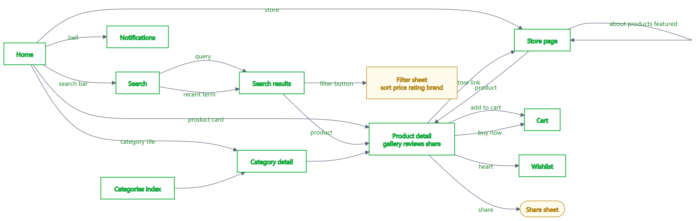
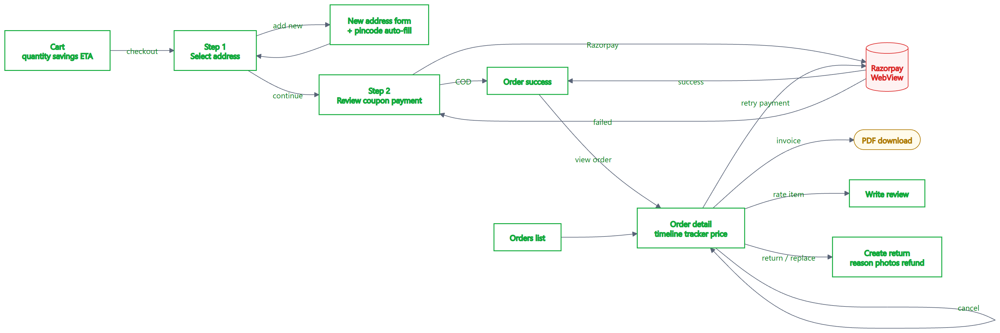
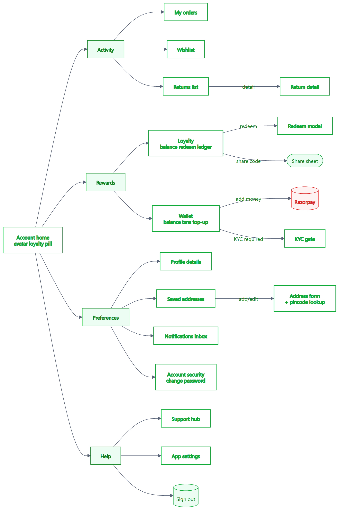
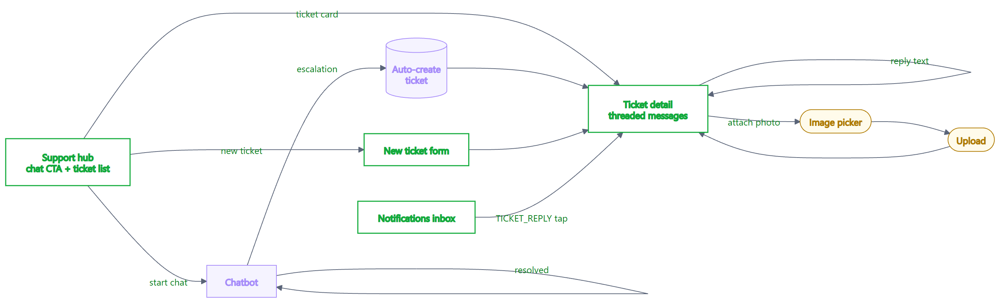
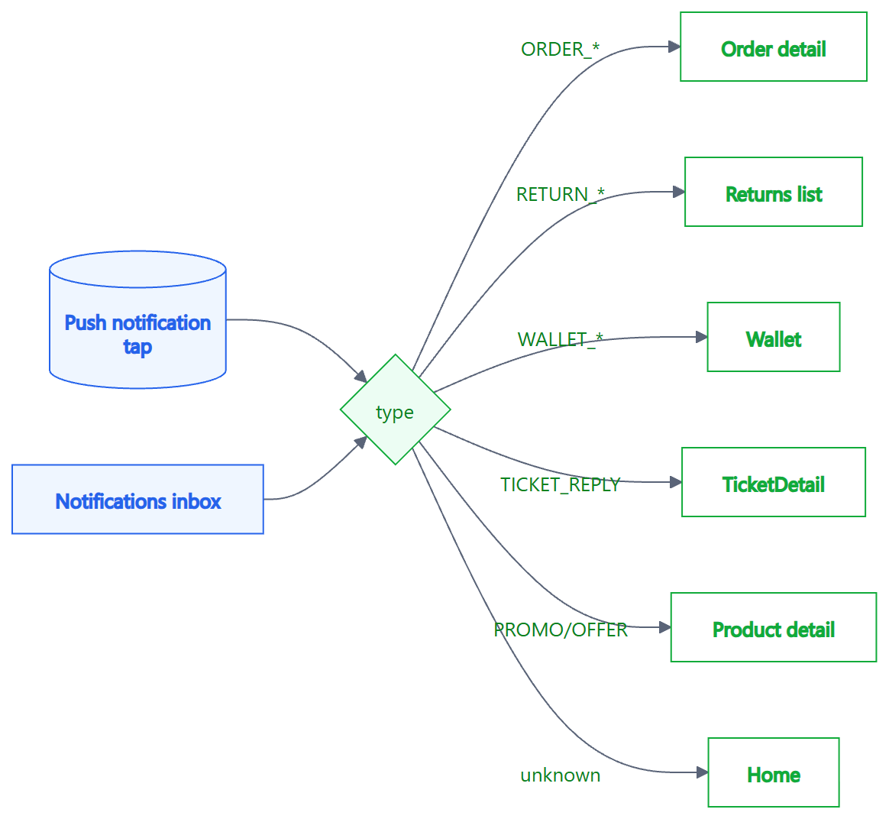

<div class="cover-page">

<div class="cover-brand">
  <span class="cover-logo">Xelnova</span>
  <span class="cover-badge">Mobile · Customer · Detailed Roadmap</span>
</div>

<div class="cover-headline">

# Customer Mobile App
## Detailed Delivery Roadmap

</div>

<div class="cover-meta">
  <div><span class="meta-k">Project</span><span class="meta-v">Native customer shopping app · Android + iOS</span></div>
  <div><span class="meta-k">Status</span><span class="meta-v ok">All 4 phases complete · Type-safe · Lint-clean</span></div>
  <div><span class="meta-k">Stack</span><span class="meta-v">Expo SDK 54 · React Native 0.81 · NativeWind v4</span></div>
  <div><span class="meta-k">Architecture</span><span class="meta-v">Single Expo codebase · Same monorepo as web · Shared backend</span></div>
  <div><span class="meta-k">Document version</span><span class="meta-v">v1.0 · May 2026</span></div>
</div>

<div class="cover-toc">

**Contents**

1. Vision & Strategy
2. System Architecture
3. Phase-by-Phase Delivery
4. Screen Flows (visual)
5. Quality & Engineering Discipline
6. Path to Launch
7. Roadmap Beyond MVP
8. Appendix · Stack & Dependencies

</div>

<div class="cover-footer">
One backend. Two storefronts. Zero drift.
</div>

</div>

<div class="page-break"></div>

## 1 · Vision & Strategy

### What we set out to build

A **native customer storefront** for Android and iOS, designed in the spirit of Blinkit-style speed-first commerce while staying on-brand with Xelnova's mint-green identity. The app reaches **full feature parity with the existing Xelnova web storefront** and adds capabilities only possible on a real phone: push notifications, biometric-grade secure token storage, and a tap-driven shopping flow that feels at home next to Amazon, Flipkart and Blinkit on the user's home screen.

### Why mobile (and why now)

<div class="two-col">

<div>

**Customer reach**
Over 70 % of Indian e-commerce traffic now originates on mobile. A web app loaded inside a phone browser leaves discoverability, retention and engagement on the table — push notifications alone lift order frequency by 25 – 40 % in benchmarks.

**Operational lock-in**
Once a customer installs an app, the cost of switching to a competitor is substantially higher than re-typing a URL. Loyalty programs, saved cards, addresses, and notification permissions all reinforce this.

</div>

<div>

**Strategic option value**
The same monorepo and component library that powers this customer app can power a *seller* mobile app and a *business* mobile app at a fraction of the cost — between 60 % and 70 % of the foundational work is already done.

**Brand integrity**
Showing up in the App Store and Play Store with a polished native app signals scale and seriousness that a mobile website cannot.

</div>

</div>

### Design direction

The visual language is a **Blinkit-leaning hybrid**. Concrete decisions:

- **Dense product surfaces** — three-up grids, larger product images, prominent price chips
- **One-tap actions** — "Add to cart" and "Buy now" never more than two taps from any product
- **Sticky context** — location chip, search bar, cart badge always visible at the top of Home and Search
- **Brand fidelity** — mint primary (`#11ab3a`), deep mint (`#0c831f`), pale mint surfaces — extracted from the web theme so identity stays consistent across channels
- **Accessibility built in** — generous `hitSlop` on every interactive element, semantic text scales, sufficient contrast ratios, all icons paired with text labels

<div class="page-break"></div>

## 2 · System Architecture

### Monorepo layout

```
xelnova-web-new (root)
├── apps/
│   ├── web              ← existing customer web app
│   ├── admin            ← admin panel (web)
│   ├── seller           ← seller dashboard (web)
│   ├── business         ← B2B portal (web)
│   ├── api              ← Next-side API routes
│   └── mobile-web       ← NEW: customer mobile app
│       ├── app/         ← Expo Router file-based screens (40+)
│       ├── src/         ← lib, components, hooks
│       └── docs/        ← client-facing artifacts (this PDF)
├── backend/             ← NestJS API service (unchanged)
└── packages/
    ├── api              ← shared HTTP client (unchanged)
    ├── utils            ← shared utilities (unchanged)
    └── ui-native        ← NEW: shared React Native components
```

### Why this layout works for the business

| | |
|---|---|
| **Single source of truth** | One backend powers web *and* mobile. Every endpoint is contractually identical, so a coupon launched on web works on mobile the same minute. |
| **Account portability** | Cart, orders, wallet, loyalty, support tickets — all live in the shared backend, so a customer can start checkout on web and finish on mobile. |
| **Engineering velocity** | A shared `@xelnova/api` package means we never hand-write a duplicate API call. Adding a new endpoint is one place, not two. |
| **Future apps are cheap** | A future seller mobile app or business mobile app reuses the auth, navigation, query, and component patterns established here. |

### Technology choices and rationale

| Concern | Choice | Rationale |
|---|---|---|
| Framework | Expo SDK 54 + React Native 0.81 | Single codebase for iOS + Android · Cloud builds via EAS · OTA updates without store reviews |
| Navigation | Expo Router (file-based, typed) | Compile-time route safety · Deep-linking out of the box · Mirrors Next.js conventions developers already know |
| Styling | NativeWind v4 | Same Tailwind classes as web — single design system, single mental model |
| Server state | TanStack React Query | Caching, optimistic updates, retries, infinite scrolling — production-grade defaults |
| Lists | Shopify FlashList | 60 fps scrolling on huge product grids; significant memory savings vs FlatList |
| Payments | Razorpay (WebView) | Reuses existing web checkout integration · PCI-DSS scope unchanged · No native SDK to maintain |
| Push | Expo Notifications + FCM/APNs | Single API, both platforms · Token registration handled in one place |
| Storage | `expo-secure-store` (tokens), `AsyncStorage` (preferences) | Tokens encrypted at rest in iOS Keychain / Android Keystore |
| Image upload | `expo-image-picker` + multipart | Reused by returns and ticket replies |
| Builds | Expo EAS Build & Submit | Cloud builds — no Mac required for iOS · Direct submit to both stores |

<div class="page-break"></div>

## 3 · Phase-by-Phase Delivery

The work was split into four sequential phases, each ending in a typecheck-clean and lint-clean intermediate state. Every phase shipped end-to-end functionality — there is no scaffolding waiting for "later".

### Phase 0 · Foundation

| Deliverable | Detail |
|---|---|
| Theme tokens | Brand palette, type scale, spacing extracted from web `globals.css` |
| NativeWind setup | Shared Tailwind preset across `mobile-web` and `ui-native` |
| Provider stack | SafeArea · gesture handler · React Query · auth · error boundary · onboarding gate · notifications bootstrap |
| `@xelnova/ui-native` v0 | 18 reusable components: Button · Card · Pill · Input · Skeleton · Avatar · Divider · RadioCard · Stars · RatingSummary · Image · Price · RatingPill · ProductCard · CategoryTile · EmptyState · SectionHeader · TagChip |
| Auth wiring | `@xelnova/api` configured with `expo-secure-store` token persistence; rehydrates session on launch |

### Phase 1 · Authentication

| Screen | Capability |
|---|---|
| Login | Email + password sign-in |
| Register | New customer onboarding with optional phone |
| Forgot password | Email-based reset trigger |
| Reset password | Token-based password set |
| Auth context | Persistent session via secure storage; auto-rehydrates on app open; logs out cleanly across all queries |

### Phase 2 · Browse & Discovery

| Screen | Capability |
|---|---|
| Home | Hero carousel · category strip · flash deals · featured · trending · new arrivals · best sellers · recently viewed (local) |
| Search | Debounced autocomplete · popular searches · recent searches with one-tap clear · filter sheet |
| Filter sheet | Sort · price range · rating · brand · category |
| Product detail | Image gallery · ratings & reviews · stock awareness · seller card · highlights · related products · share |
| Store detail | About · categories · featured products · full catalog · navigation tabs |
| Categories | Top-level grid + per-category browse with subcategories |

<div class="page-break"></div>

### Phase 3 · Cart, Checkout & Orders

| Screen | Capability |
|---|---|
| Cart | Live quantity sync · savings line · shipping config · proceed-to-checkout |
| Checkout · address | Saved-address picker with `RadioCard`s · "add new" inline |
| Checkout · review | Order summary · coupon application · payment method (COD or Razorpay) |
| Razorpay WebView | Hosted checkout in-app · bridge messages parsed for success / failure / dismiss |
| Checkout · success | Order confirmation · ETA · view-order CTA |
| Orders list | Status pills · image stacks · ship-by dates |
| Order detail | Timeline · shipment tracker · price breakdown · address · payment · retry-payment · invoice download · cancel · rate item · return / replace |

### Phase 4 · Account, Post-Purchase & Engagement

| Screen | Capability |
|---|---|
| Account home | 5-section menu · live loyalty pill · avatar · settings shortcut |
| Profile | Edit name, email, phone |
| Saved addresses | List · add · edit · delete · set default · **India-Post pincode auto-fill** |
| Wallet | Balance · paginated transactions · Razorpay top-up with KYC gate |
| Loyalty & referral | Balance · redeem-to-wallet · paginated ledger · referral code (copy + share) · apply code |
| Returns | List · create return with photo upload · reason selector |
| Reviews | Submit per-product reviews · PDP shows summary + approved reviews |
| Notifications | Paginated inbox · mark-as-read · deep-link routing · push registration |
| Support · chatbot | Conversational entry · auto-creates ticket on escalation |
| Support · list | Tickets with status pills |
| Support · detail | Threaded messages with role-aware bubbles · photo attachments · multi-photo reply |
| Support · manual | Direct ticket creation for users who skip chat |
| Account security | Change/set password · provider-aware (email vs Google vs phone) |
| Settings | Push toggle · language placeholder · terms / privacy / contact links · version · sign out · delete-account funnel |
| Onboarding | First-launch 3-slide intro · persisted skip flag |

### Cross-cutting capabilities

| Capability | Implementation |
|---|---|
| Push notifications | Auto-registers Expo Push Token after login; routes ORDER_*, RETURN_*, WALLET_*, TICKET_*, PROMO/OFFER notification types to the correct screen on tap |
| Deep linking | `xelnova://` scheme + universal links to `https://xelnova.in/*` — order/product/category links open in-app |
| Recently viewed | Last 20 products tracked locally; surfaced as a home rail |
| Recent searches | Last 10 queries surfaced on the search empty state |
| Sharing | Native share sheet for products and referral codes |
| Image upload | `expo-image-picker` → multipart → Cloudinary; reused by returns & ticket replies |
| Pagination | `useInfiniteQuery` for notifications, wallet, loyalty ledger |
| Error boundary | App-level catch with friendly retry UI |

<div class="page-break"></div>

## 4 · Screen Flows

The following diagrams show the full information architecture of the app. Every box is a real screen that exists in the codebase; every arrow is a real navigation edge.

### 4.1 · Top-level app map

From cold-start splash through onboarding and authentication, into the five-tab bottom bar.

<div class="diagram">



</div>

### 4.2 · Browse & discovery

How customers find products: home, search, filters, categories, store pages and the product detail page.

<div class="diagram">



</div>

<div class="page-break"></div>

### 4.3 · Cart, checkout & orders

The end-to-end purchase journey including the Razorpay WebView, success state, and post-purchase actions on the order detail page.

<div class="diagram">



</div>

### 4.4 · Account hub

The account section, organised into Activity, Rewards, Preferences and Help groups — each fanning out to the corresponding screens.

<div class="diagram tall">



</div>

<div class="page-break"></div>

### 4.5 · Support flow

The support journey starts with the chatbot. Unresolved queries auto-create a ticket and the user is dropped into the threaded ticket detail screen.

<div class="diagram">



</div>

### 4.6 · Push notification routing

How a tap on a push notification — or a tap on an in-app inbox row — gets routed to the correct screen based on the notification type.

<div class="diagram">



</div>

<div class="page-break"></div>

## 5 · Quality & Engineering Discipline

### Type safety

| | |
|---|---|
| TypeScript strict mode | Enabled across `apps/mobile-web` and `packages/ui-native` |
| `tsc --noEmit` | Clean — 0 errors |
| Linter | Clean — 0 warnings |
| Expo Router typed routes | All 40+ routes type-checked at compile time — invalid `router.push()` calls fail the build |
| API contracts | 100 % reuse of `@xelnova/api` — no duplicate request code, no contract drift |

### Security

| | |
|---|---|
| Token storage | iOS Keychain · Android Keystore via `expo-secure-store` — never in plaintext |
| HTTPS-only | Backend pinned to `https://api.xelnova.in` |
| Razorpay | Hosted WebView checkout — card details never touch the app's process |
| Permissions | Photo, camera, notifications — all gated behind explicit user prompts with rationale strings |
| KYC | Wallet top-up gated by Aadhaar verification status |

### Performance

| | |
|---|---|
| List rendering | FlashList for product grids — keeps frame rate at 60 fps even on 1000-item lists |
| Image caching | `expo-image` with disk-backed cache — products cached after first view |
| Network resilience | React Query auto-retry on transient failures · per-screen error states · refresh-on-focus |
| Bundle size | Single JavaScript bundle, code-splitting handled by Expo for OTA updates |

### Resilience

| | |
|---|---|
| Error boundary | App-level catch with friendly retry UI; no red-screening in production |
| Pagination | Infinite-query patterns with end-reached and "load more" affordances |
| Stale-while-revalidate | Data shows immediately from cache, refreshes silently in the background |
| Offline tolerance | Cached data visible offline · graceful "no connection" states on critical screens |

<div class="page-break"></div>

## 6 · Path to Launch

A realistic six-week launch plan from the current state to the public-facing app.

<div class="timeline">

<div class="t-row">
<span class="t-week">Week 1</span>
<span class="t-task"><strong>Build pipeline & assets</strong> · `eas.json` profiles (development · preview · production) · final 1024 × 1024 icon · adaptive Android icon · splash artwork · APNs key + FCM `google-services.json` uploaded to EAS Credentials</span>
</div>

<div class="t-row">
<span class="t-week">Week 2</span>
<span class="t-task"><strong>Internal alpha</strong> · 10 stakeholders on TestFlight + Play Internal · bug bash · copy review · store-listing copy authored</span>
</div>

<div class="t-row">
<span class="t-week">Week 3</span>
<span class="t-task"><strong>Closed beta</strong> · 50 – 100 invited users · feedback collected via in-app support tickets · weekly bug-fix release</span>
</div>

<div class="t-row">
<span class="t-week">Week 4</span>
<span class="t-task"><strong>Closed beta continues</strong> · iterate on feedback · finalise screenshots · privacy policy and support URLs verified live</span>
</div>

<div class="t-row">
<span class="t-week">Week 5</span>
<span class="t-task"><strong>Submit to stores</strong> · App Store review (typically 24 – 72 hours) · Play Store review (typically same-day) · prepare release notes</span>
</div>

<div class="t-row launch">
<span class="t-week">Week 6</span>
<span class="t-task"><strong>Public launch</strong> · day-one analytics dashboard · push-notification announcement to existing web customers · monitoring alerts wired to Slack</span>
</div>

</div>

### Outstanding pre-launch items

The codebase is shippable. The remaining work is operational, not engineering.

| Workstream | Owner | Effort |
|---|---|---|
| `eas.json` build profiles + `submit` config | Engineering | ~½ day |
| App Store Connect + Play Console listings | Marketing | 1 – 2 days |
| Final visual assets (icon, splash, screenshots) | Design | 2 – 3 days |
| APNs key + FCM credentials uploaded to EAS | Engineering | ½ day |
| Privacy policy + support URLs published | Legal/Marketing | 1 day |
| First production build + smoke test | Engineering | ½ day |

<div class="page-break"></div>

## 7 · Roadmap Beyond MVP

What's in scope for the launch is the customer-MVP feature set — feature parity with web plus mobile-only enhancements. The following is a deliberately scoped *post-launch* roadmap.

### Quarter 1 (post-launch · stabilise & measure)

- **In-app analytics** — PostHog or Amplitude wired to all key events (add-to-cart, checkout, payment success, push opens)
- **Crash reporting** — Sentry for production crash visibility and diagnostics
- **Offline indicator** — `@react-native-community/netinfo` banner when the device is offline
- **Biometric quick re-login** — Face ID / fingerprint with `expo-local-authentication`
- **A/B test framework** — server-controlled variants for home rail order, hero copy, CTA wording

### Quarter 2 (engagement & differentiation)

- **Localisation** — Hindi · Marathi · Tamil · Bengali via `expo-localization`
- **In-app KYC** — Aadhaar verification via Digilocker WebView (today's flow uses the website)
- **Product comparison** — side-by-side compare of up to 3 products
- **Wishlist folders & sharing** — organise saved items, share lists with friends
- **Stories / video commerce** — vertical video PDP enrichment for fashion and lifestyle SKUs

### Quarter 3 (scale & efficiency)

- **OTA update channel** — staged rollouts for hot-fixes without going through store review
- **Background fetch** — pre-warm cart and orders before the user opens the app
- **Personalised home** — server-side ML-driven product rails based on view + purchase history
- **Razorpay native SDK** — replace WebView with native module for ~1 second faster checkout

<div class="page-break"></div>

## 8 · Appendix · Stack & Dependencies

### Runtime dependencies (production)

| Package | Version | Purpose |
|---|---|---|
| `expo` | ~54.0 | App framework |
| `react-native` | 0.81 | Native runtime |
| `expo-router` | ~6.0 | File-based navigation |
| `nativewind` | ^4.2 | Styling |
| `@tanstack/react-query` | ^5.59 | Server state |
| `@shopify/flash-list` | 2.0 | High-performance lists |
| `react-native-webview` | 13.15 | Razorpay + KYC hosted flows |
| `expo-secure-store` | ~15.0 | Encrypted token storage |
| `@react-native-async-storage/async-storage` | 2.2 | Local preferences |
| `expo-notifications` | ~0.32 | Push delivery |
| `expo-image-picker` | ~17.0 | Camera & gallery |
| `expo-image` | ~3.0 | Cached image rendering |
| `expo-clipboard` | latest | Copy referral codes |
| `lucide-react-native` | ^1.16 | Icon library |
| `@xelnova/api` | workspace | Shared HTTP client |
| `@xelnova/ui-native` | workspace | Shared component library |

### Backend integration points

The mobile app talks to **47 distinct REST endpoints** across these modules — every one of them was already in production for the web app:

`auth` · `products` · `categories` · `cart` · `orders` · `users` · `search` · `reviews` · `payment` · `returns` · `wallet` · `tickets` · `notifications` · `wishlist` · `verification` · `stores` · `upload`

### Repository hygiene

- All new code is **TypeScript strict** and lint-clean
- File naming follows the existing monorepo conventions (kebab-case for files, PascalCase for components)
- Every screen has a corresponding entry in `.expo/types/router.d.ts` — invalid `router.push()` calls are caught at compile time
- Every shared component lives in `packages/ui-native` and is unit-style typed against React Native's `ViewProps`/`TextProps`/etc.

---

<div class="end-mark">

**End of document**

Xelnova Customer Mobile App · Detailed Roadmap · v1.0

</div>
